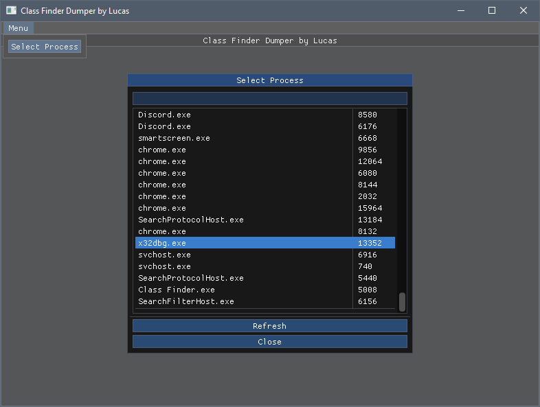
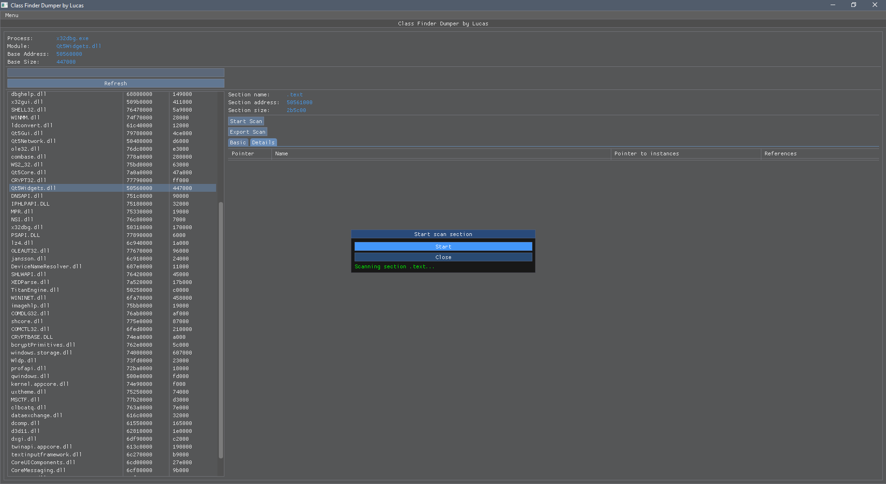
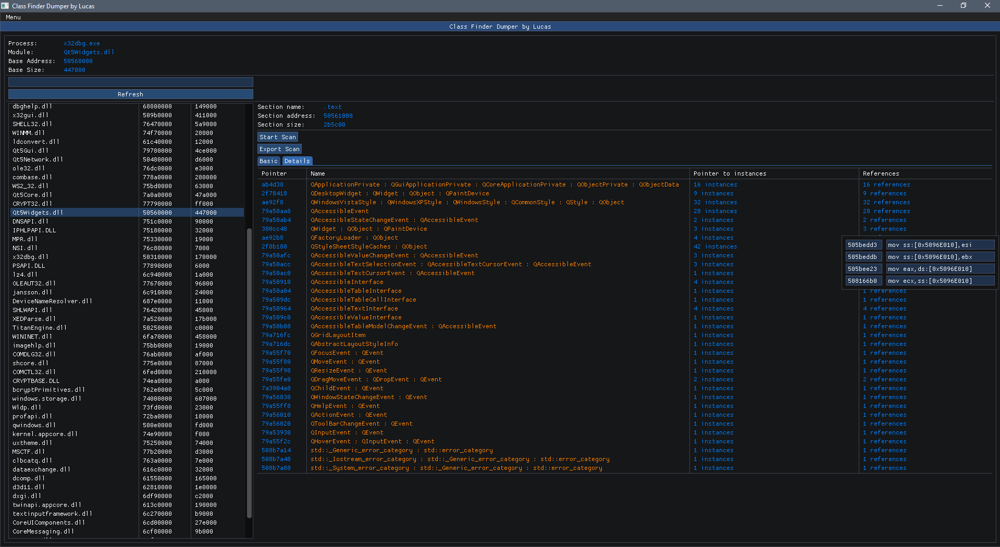

# Class Finder Dumper
 Pointer search for any classes using the RTTI feature.

## Design goals
A tool to facilitate the collection and visualization of the RTTI resource.

###### Runtime
Allow runtime collection of pointers with the available rtti feature.

## How to use?
Select the process, choose the module and click on start scan.
Then click on export scan.

## Images
Below are some images of the program, showing his work on x32dbg.

